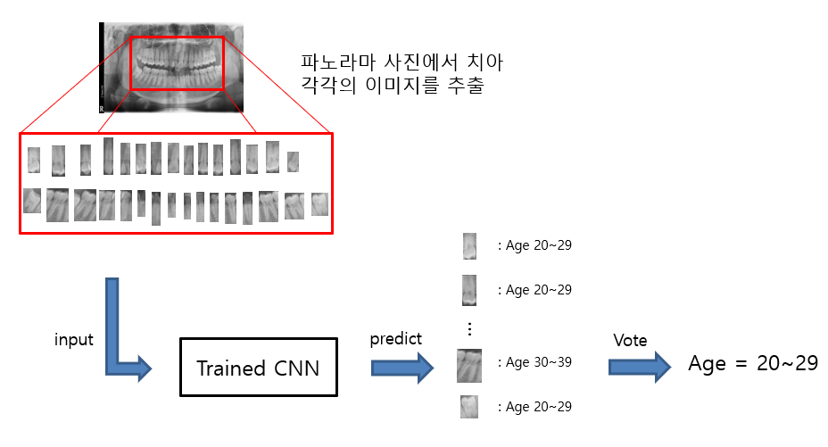

# AEDC : Age Estimation of Dental radiographs based on CNN

### 💻 Skills

### ⚒️ Tools

  
  

 

## Dental Panoramic Image-based Age Estimation Network

 

## DATA

The panoramic dental images are segmented to separate individual teeth, each identified by their specific tooth number. Simultaneously, crowned teeth and treated teeth are also distinguished within the images.

After segmenting the dental images to isolate individual teeth objects, they are then saved in the following format:

 

## CNN regression model 

I created a regression model using CNN and sigmoid. 

In forensic odontology, when inferring age from panoramic dental images, an error margin of up to 10 years is considered significant. Therefore, using a regression model allows for a more meaningful interpretation within this allowable error range.

The structure of the CNN Regression model is as follows:

 

## Result

